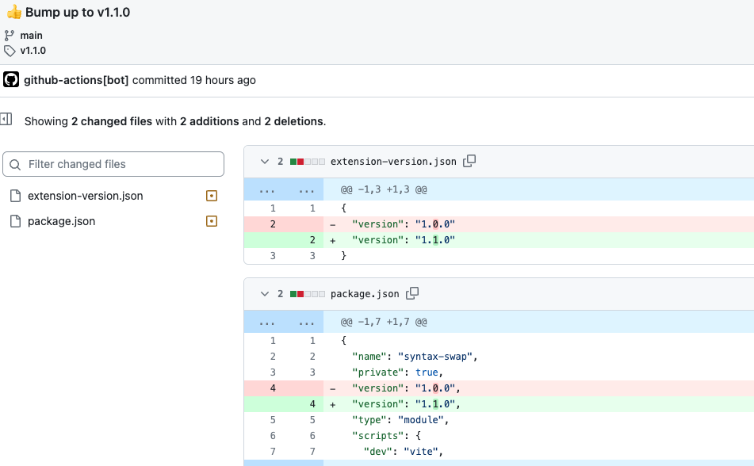
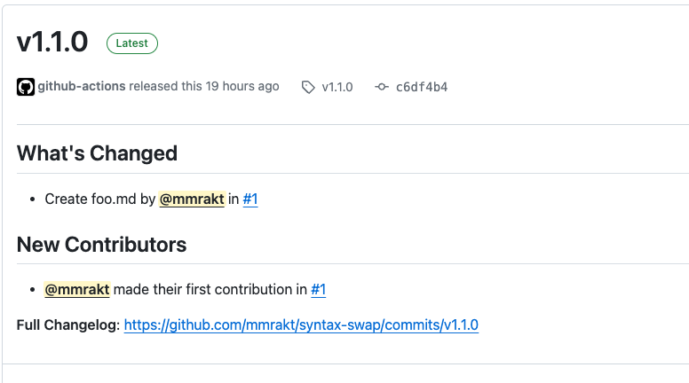

# Update chrome extension version action

This Action automates the process of updating chrome extension apps.

|                        |                        |
| ---------------------- | ---------------------- |
|  |  |

## Feature

- Update to next version and commit to repository(package.json, manifest.json)
- Upload Chrome Web Store
- Create Release Note

## Usage

### Prerequisites

Please create the following labels in advance.

- `release:major`
- `release:minor`
- `release:patch`

When a pull request is merged, the label assigned to it determines which layer is updated.

> [!NOTE]
>
> - Label names must match exactly
> - If neither label is given, "patch" is selected by default

### Basic

```yml
steps:
  uses: mmrakt/update-chrome-extension-version-action@v0.1.0
  with:
    github_token: ${{ secrets.GITHUB_TOKEN }}
```

A commit will be pushed that updates the version of package.json and manifest.([e.g.](https://github.com/mmrakt/syntax-swap/commit/c6df4b475795a524633c382a09ab65d96785d1b3))

### Advanced

```yml
steps:
  uses: mmrakt/update-chrome-extension-version-action@v0.1.0
  with:
    github_token: ${{ secrets.GITHUB_TOKEN }}
    manifest_file_path: "extension-version.json"
    upload_chrome_web_store: true
    chrome_extension_id: ${{ secrets.EXTENSION_ID }}
    google_client_id: ${{ secrets.CLIENT_ID }}
    google_client_secret: ${{ secrets.CLIENT_SECRET }}
    refresh_token: ${{ secrets.REFRESH_TOKEN }}
    zip_file_name: "archive"
    out_dir: "./build"
    create_release_note: true
```

### manifest_file_path:

manifest version file path

- default: `manifest.json`

### upload_chrome_web_store:

- default: false

### chrome_extension_id:

chrome extension id

### google_client_id:

google cloud client id

### google_client_secret:

google cloud client secret

### refresh_token:

google cloud refresh token

ref: [How to generate Google API keys](https://github.com/fregante/chrome-webstore-upload/blob/main/How%20to%20generate%20Google%20API%20keys.md)

### zip_file_name:

- default: `output`

### out_dir:

- default: `./dist`

### create_release_note:

- default: false

## License

[MIT](LICENSE)
